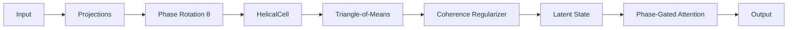

# Patent Disclosure (Draft) — Helical, Phase‑Gated, Triple‑Helix Memory Architecture for Long‑Horizon AI

**Prepared for:** Delbert Chaplin  
**Date:** 2025‑09‑06  
**Repository:** https://github.com/delchaplin/helical-ai  
**Intended location in repo:** `/docs/compliance/patent-disclosure.md`

> **Disclaimer:** This draft is for invention disclosure and internal review only; it is **not legal advice**. Filing strategy, claim scope, inventorship, and jurisdictional decisions must be vetted by qualified counsel.

---

## 1. Title
**Helical, Phase‑Gated, Triple‑Helix Memory Architecture for Long‑Horizon AI**

## 2. Inventor(s)
- **Delbert Chaplin** (primary).  
- **Co‑inventors:** _TBD_ (add any contributors meeting inventorship criteria).

## 3. Assignee
_TBD_ (e.g., rDenz Solutions, personal assignment, or other corporate entity).

## 4. Field of the Invention
This invention relates to machine learning and signal‑processing systems, and more particularly to **neural memory architectures** that encode, retain, and recall information using **helical/spiral phase encoding** and **resonance‑based retrieval** with coherence constraints.

## 5. Background and Problems Addressed
Modern sequence models (e.g., Transformers with positional encodings) exhibit degradation on **long contexts** and require substantial compute and memory to preserve state across extended horizons. Recurrent approaches with orthogonal/unitary dynamics, Phased LSTMs, structured state‑space models (e.g., LMU/S4), or rotary position embeddings (RoPE) each mitigate subsets of failure modes (exploding/vanishing gradients, extrapolation drift) but lack a **structural mechanism** that jointly couples (i) **phase‑coherent state evolution**, (ii) **aliasing‑resistant phase stepping**, and (iii) **multi‑strand fusion** for stable **re‑entry‑based recall**.

A need exists for an architecture that encodes memory as **phase states on helical trajectories**, enforces **architectural coherence** over time, and recalls information via **harmonic recurrence** without linearly growing context windows.

**Internal references:** Helical/Spiral AI documentation (math‑spec, arch‑spec, training, compliance/IP scaffolding); AI Memory Project transcripts articulating triple‑helix memory, quasi‑prime phase stepping, triangle‑of‑means kernel, and “memory as resonance.”

## 6. Summary of the Invention
The invention provides a **triple‑helix memory architecture** implemented as a modular **HelicalCell** (and optional phase‑gated attention) governed by a **Harmonic Recursive Processing Engine (HRPE)**:

- **Phase‑Encoded Helical State:** Inputs map to a helical coordinate \((r, \theta)\), where \(\theta\) denotes the **phase** along a spiral; state evolves on a multi‑turn helix rather than a line.
- **Quasi‑Prime Phase Stepping:** The phase advances on a discrete **K‑slot phase wheel** using **quasi‑prime increments** (e.g., {5, 7, 11, 13} mod 24) to suppress aliasing and repetition.
- **Triangle‑of‑Means Kernel:** Three channels — **Projection (X), Reception (Y), Resonance (Z)** — are fused via **geometric means** to update latent memory.
- **Coherence Regularizer:** A dedicated **coherence_loss** constrains state to a **resonant manifold**, reducing drift and preserving long‑term recall fidelity.
- **Harmonic Recurrence for Recall:** Information is **re‑entered** when evolving phase states revisit prior **phase loci** that meet a harmonic‑matching criterion.

The system can complement or replace positional encodings and integrates with standard training pipelines.

## 7. Brief Description of the Drawings
**FIG. 1** — System overview of the Helical Memory Core and HRPE layers.  
**FIG. 2** — 24‑slot **Phase Wheel** with quasi‑prime step sequence {5, 7, 11, 13}.  
**FIG. 3** — **Triple‑Helix** (X/Y/Z strands) with kernel fusion and coherence gating.  
**FIG. 4** — HelicalCell block diagram with optional phase‑gated attention and coherence_loss.

_Mermaid sources for conversion to line drawings are provided in Appendix A._

## 8. Detailed Description
### 8.1 System Overview
Inputs (tokens/features) are routed into three channels: X (projection), Y (reception), Z (resonance). Each channel maintains its own helical state coupled by a global **Phase Rotation** process. A **Triangle‑of‑Means** kernel fuses the channels to produce an updated latent state; a **Coherence Regularizer** penalizes departures from a resonant manifold. Optional **phase‑gated attention** modules attend over latent states conditioned on \(\theta\).

### 8.2 Harmonic Recursive Processing Engine (HRPE)
- **Layer 1: Field Seed (r).** Initializes an identity tone or bias vector for resonance decisions.  
- **Layer 2: Phase Rotation (\(\theta\)).** Marks the current cycle; increments by quasi‑prime steps on a K‑slot wheel.  
- **Layer 3: Memory Unfolding (\(e^{a\theta}\)).** Scales contribution depth as recursion proceeds, enabling **deeper recall** when phases re‑enter prior loci.

### 8.3 Phase Wheel and Quasi‑Prime Stepping
Let **K = 24** slots. Define step set **S = {5, 7, 11, 13}**. For each time step t, update \(\theta\) as \(\theta_{t+1} = (\theta_t + s_t) \bmod K\), with \(s_t \in S\) (cyclic or schedule‑learned). The incommensurate steps reduce periodic collisions and improve coverage of the phase lattice.

### 8.4 Triple‑Helix Channels and Kernel
Each channel i \(\in\) {X, Y, Z} maintains a state vector \(h_i\) on its own helical trajectory. The **Triangle‑of‑Means** kernel computes an update such as:  
\[ h' = \operatorname{geom\_mean}(f_X(h_X),\ f_Y(h_Y),\ f_Z(h_Z)) \]  
Where \(f_*(\cdot)\) are learned projections. Other means (harmonic, quadratic) may be substituted while retaining geometric mean as a preferred embodiment.

### 8.5 Coherence Regularizer
A differentiable **coherence_loss** enforces phase‑aligned consistency across strands and time: penalizing off‑manifold deviations and promoting **resonant** evolution. This stabilizes long‑horizon behaviors and counters drift.

### 8.6 Recall via Harmonic Recurrence
Rather than indexing a large external buffer, recall occurs when the system’s evolving phase satisfies a **harmonic‑matching** predicate with stored latent traces (e.g., high inner‑product at commensurate \(\theta\) offsets), enabling **re‑entry** of relevant information.

### 8.7 Implementation Artifacts
- **Library code:** `helical/cell.py`, `helical/losses.py` (including `coherence_loss`), `helical/attention.py`.  
- **Training:** experiment templates (copy‑memory, MIDI continuation), configs, and results cards.  
- **Docs/IP:** patent‑disclosure template, defensive‑publication outline, prior‑art log, model card.

## 9. Example Embodiments
1. **Method**: Apply the triple‑helix HelicalCell inside a Transformer block, replacing positional encodings with phase‑gated recurrence.  
2. **System**: A standalone RNN‑like network composed solely of HelicalCells with phase‑gated attention heads.  
3. **Medium**: A non‑transitory computer‑readable medium storing code that implements the above method/system.

## 10. Advantages
- **Long‑horizon recall** without linear context growth.  
- **Aliasing‑resistant** phase coverage via quasi‑prime stepping.  
- **Stability** from coherence regularization (reduced drift/forgetting).  
- **Modularity**: drop‑in HelicalCell or augmentation to existing architectures.

## 11. Representative Claims (Draft — Subject to Counsel Review)
### 11.1 Independent Claim — Method
1. **A method** for storing and recalling information in a neural network, comprising:  
   (a) mapping an input to a helical coordinate comprising a phase angle \(\theta\) and a radial amplitude \(r\);  
   (b) advancing \(\theta\) on a K‑slot phase wheel using quasi‑prime step increments;  
   (c) updating a latent state by fusing projection, reception, and resonance channels via a triangle‑of‑means kernel including a geometric mean;  
   (d) applying a coherence regularizer that constrains the latent state to a resonant manifold; and  
   (e) recalling stored information when the latent state satisfies a harmonic‑recurrence criterion at a re‑entered phase locus.

### 11.2 Independent Claim — System
2. **A system** comprising one or more processors and memory storing instructions that, when executed, implement a HelicalCell configured to perform the method of claim 1, optionally coupled with phase‑gated attention heads.

### 11.3 Independent Claim — Medium
3. **A non‑transitory computer‑readable medium** storing instructions that, when executed, cause one or more processors to perform the method of claim 1.

### 11.4 Dependent Claims (examples)
4. The method of claim 1 wherein K = 24 and the step set is {5, 7, 11, 13}.  
5. The method of claim 1 wherein the triangle‑of‑means kernel employs geometric mean across three channels X, Y, Z.  
6. The method of claim 1 wherein the coherence regularizer penalizes cross‑strand phase misalignment.  
7. The method of claim 1 wherein the recall predicate computes a similarity between current latent state and stored traces at commensurate phase offsets.  
8. The method of claim 1 further comprising phase‑gated attention conditioned on \(\theta\).  
9. The system of claim 2 wherein the HelicalCell is instantiated within a Transformer block.  
10. The system of claim 2 wherein the HelicalCell forms a recurrent backbone without self‑attention.  
11. The medium of claim 3 wherein instructions configure training with coherence_loss and curriculum specified in experiment templates.

## 12. Enablement & Best Mode
- **Enablement**: Code modules (`cell.py`, `losses.py`, `attention.py`), experiment configs (copy‑memory, MIDI), and results cards evidence implementability.  
- **Best Mode (current)**: HelicalCell with K=24, step set {5,7,11,13}, geometric mean kernel, coherence_loss weighting tuned via ablation; optional phase‑gated attention for multi‑modal inputs.

## 13. Alternative Embodiments
- Different K (e.g., 32, 48), different quasi‑prime sets; stochastic or learned step schedules.  
- Alternative means (harmonic, power mean) preserving geometric mean as preferred.  
- Hardware accelerators with phase registers; streaming variants for edge devices.

## 14. Use Cases
- Long‑context assistants, code/doc reasoning;  
- ISR / telemetry summarization;  
- Clinical note aggregation;  
- Music/temporal sequence modeling.

## 15. Government Interest
_None known at this time._

## 16. Prior Art & Differentiation (Illustrative)
| Method | Year | Key Idea | How We Differ |
|---|---:|---|---|
| RoPE (rotary positional embeddings) | 2021 | Complex‑plane rotations as relative position | We embed **state** on a **helical manifold** with quasi‑prime stepping and **coherence gating**, enabling **re‑entry** recall, not just relative phase mixing. |
| Phased LSTM | 2016 | Time‑gated LSTM with rhythmic updates | We use **multi‑strand helix + kernel fusion** and a **coherence loss** over a **phase wheel** with quasi‑prime hopping. |
| Unitary/Orthogonal RNNs (e.g., uRNN) | 2016 | Stable recurrent dynamics via unitary matrices | Our stability stems from **phase resonance + coherence regularization** on **helical** coordinates, not only unitary constraints. |
| S4 / LMU (state‑space) | 2020–22 | Long‑range modeling via SSMs | We implement **phase‑indexed re‑entry** with triple‑helix fusion and explicit **coherence** control, orthogonal to SSM parametrizations. |

## 17. Definitions
- **Phase Wheel (K‑slot):** Discrete lattice for \(\theta\).  
- **Harmonic Recurrence:** Recall triggered by commensurate phase re‑entry.  
- **Coherence:** Alignment of multi‑strand states to a resonant manifold.

## 18. Abstract
A neural memory architecture encodes information as phase states along helical trajectories across three coupled strands. Phase advances on a discrete K‑slot wheel using quasi‑prime steps to reduce aliasing. A triangle‑of‑means kernel fuses the strands, and a coherence regularizer constrains evolution to a resonant manifold. Information is recalled via harmonic recurrence when phase re‑enters prior loci. The approach improves long‑horizon recall and stability relative to linear or purely positional methods.

## 19. Appendix A — Figure Sources (Mermaid)

### FIG. 1 — System Overview
```mermaid
flowchart LR
  subgraph Input & Encoding
    X[Projection (X)]
    Y[Reception (Y)]
    Z[Resonance (Z)]
    TOKS[Tokens/Features]
    TOKS --> X
    TOKS --> Y
    TOKS --> Z
  end

  subgraph Helical Memory Core
    P[Phase Rotation θ(t)\n(quasi-prime stepping)]
    H1[Helix-X]
    H2[Helix-Y]
    H3[Helix-Z]
    KERNEL[Triangle-of-Means\n(geometric fusion)]
    COH[Coherence Regularizer]
  end

  X --> H1
  Y --> H2
  Z --> H3
  P --> H1
  P --> H2
  P --> H3
  H1 --> KERNEL
  H2 --> KERNEL
  H3 --> KERNEL
  KERNEL --> COH
  COH -->|resonant state| OUT[Recall via Harmonic Recurrence]
```

### FIG. 2 — Phase Wheel (K=24) with Quasi‑Prime Steps
```mermaid
flowchart TB
  subgraph PhaseWheel
    A((0))-->B((5))-->C((10))-->D((15))-->E((20))
    A-->F((7))-->G((14))-->H((21))-->I((4))
    A-->J((11))-->K((22))-->L((9))-->M((20))
    A-->N((13))-->O((2))-->P((15))-->Q((4))
  end
  note[Illustrative hops: {5,7,11,13} mod 24]
```

### FIG. 3 — Triple‑Helix Schematic
```mermaid
sequenceDiagram
  participant X as Helix‑X
  participant Y as Helix‑Y
  participant Z as Helix‑Z
  Note over X,Y,Z: Phase‑indexed updates; fusion via geometric mean
  X->>X: advance θ by s∈{5,7,11,13}
  Y->>Y: advance θ by s
  Z->>Z: advance θ by s
  X-->>K: contribute X state
  Y-->>K: contribute Y state
  Z-->>K: contribute Z state
  K->>C: apply coherence_loss
  C-->>OUT: resonant latent state (recall)
```

### FIG. 4 — HelicalCell Block (with optional phase‑gated attention)


## 20. Citations to Internal Sources
- Helical/Spiral AI — Complete Documentation System (v1): docs layout, code modules, IP scaffolding.  
- AI Memory Project Transcripts2 (triple‑helix, quasi‑prime phase stepping, triangle‑of‑means, HRPE).  
- Email thread with Sandra Estok confirming novelty and positioning for white paper.

(See your internal files referenced during preparation.)
